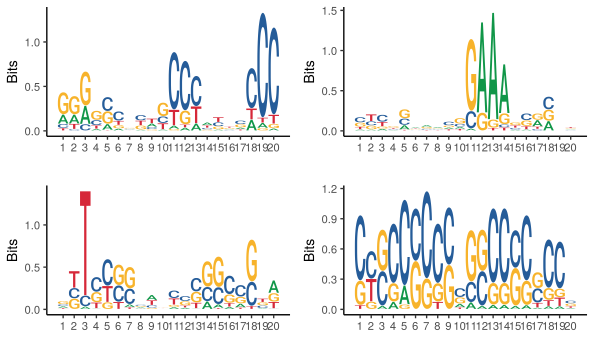

<!-- README.md is generated from README.Rmd. Please edit that file -->


# **DeepG4**: A deep learning approach to predict active G-quadruplexes

<!-- badges: start -->

[](https://codecov.io/gh/morphos30/DeepG4?branch=master)
<!-- badges: end -->

**DeepG4** is a deep learning model developed
to predict the probability of DNA sequences to form active G-Guadruplexes (found both in vitro and in vivo). 
**DeepG4** is built in keras+tensorflow and is wrapped in an R package. 


## Requirements

DeepG4 was built with `Keras 2.3.1` and `tensorflow 2.1.0`, but it
should work with any version of theses libraries.

A very convenient way to install keras and tensorflow is using `R`. The command line to install is from : <https://keras.rstudio.com/>.

``` r
install.packages("keras")
library(keras)
install_keras()
```

This will provide you with default CPU installations of Keras and
TensorFlow python packages (within a virtualenv) that can be used with
or without R.

## Installation

You can install the development version from
[GitHub](https://github.com/) with:

``` r
# install.packages("devtools")
devtools::install_github("morphos30/DeepG4")
```

### Basic usage of DeepG4

If you have a small sequence (201bp or less), you can predict the 
probability that the sequence forms an active G4.

``` r
library(Biostrings)
library(DeepG4)

sequences <- system.file("extdata", "test_G4_data.fa", package = "DeepG4")
sequences <- readDNAStringSet(sequences)

predictions <- DeepG4(sequences)
head(predictions)
```

### Using our model directly with keras in R

Using our model with keras is very simple, the code is very similar, but
you have to convert youre sequence in one-hot first. To help you, our
function `DNAToNumerical` help you to do it.

``` r

library(Biostrings)
library(DeepG4)
library(keras)

sequences <- system.file("extdata", "test_G4_data.fa", package = "DeepG4")
sequences <- readDNAStringSet(sequences)

model <- system.file("extdata", "model.hdf5", package = "DeepG4")
model <- load_model_hdf5(model)

sequences <- DNAToNumerical(sequences)

predictions <- predict(model,sequences)
```

## Detect multiple G4 using `DeepG4` in larger sequences

``` r
library(Biostrings)
library(DeepG4)
sequences <- readDNAStringSet(system.file("extdata", "promoters_seq_example.fa", package = "DeepG4"))
res <- DeepG4Scan(X = sequences,k=20,treshold=0.5)
```

This command will scan each input sequences using a sliding windows of
size `k=20` and output the corresponding DeepG4 probability (\>=
treshold) for each position (+/- 100bp) to form an active G4.

``` r
library(dplyr)
res %>% dplyr::select(-seq) %>% group_by(seqnames) %>% dplyr::slice(1:2) %>%  head
```

    # A tibble: 6 x 5
    # Groups:   seqnames [3]
      seqnames start   end width score
         <int> <int> <int> <int> <dbl>
    1        1  1241  1441   201 0.670
    2        1  1261  1461   201 0.659
    3        2  1481  1681   201 0.648
    4        2  1521  1721   201 0.517
    5        3  2161  2361   201 0.723
    6        3  2181  2381   201 0.998

## SNP effect on g-quadruplex using DeepG4

Using our model, you can predict the potential effect of a SNPs on
active G4 formation :

``` r
GetSeqFromSNPs <- function(my_granges,wsize = 201){
    SNP_pos <- (wsize - 1)/2 + 1 
    ## Compute Fasta
    SNps.seq.ref <- my_granges %>% anchor_center() %>% mutate(width = wsize) %>% getSeq(BSgenome.Hsapiens.UCSC.hg19.masked,.)
    ## Replace ref by alt
    sampleMat <- matrix(FALSE,nrow = length(SNps.seq.ref),ncol = nchar(SNps.seq.ref[1]))
    sampleMat[,SNP_pos] <- TRUE
    SNps.seq.alt <- replaceLetterAt(SNps.seq.ref, sampleMat, my_granges$alt)
    return(c(SNps.seq.ref,SNps.seq.alt))
}
require(GenomicRanges)
require(Biostrings)
require(dplyr)
require(plyranges)
require(BSgenome.Hsapiens.UCSC.hg19.masked)
SNPs <- GRanges(SNPs <- c("chr16:87350773","chr19:50093572"))
SNPs$name <- c("rs3748393","rs7249925")
SNPs$ref <- c("C","A")
SNPs$alt <- c("A","G")

SNPs_seq <- SNPs %>% GetSeqFromSNPs

DeepG4.score <- DeepG4(SNPs_seq)
SNPs$DeepG4_ref <- DeepG4.score[1:length(SNPs),]
SNPs$DeepG4_alt <- DeepG4.score[(length(SNPs)+1):nrow(DeepG4.score),]
SNPs <- SNPs %>% mutate(DeltaScore = DeepG4_alt-DeepG4_ref)
SNPs
```

    GRanges object with 2 ranges and 5 metadata columns:
          seqnames    ranges strand |         ref         alt        DeepG4_ref
             <Rle> <IRanges>  <Rle> | <character> <character>         <numeric>
      [1]    chr16  87350773      * |           C           A 0.840066134929657
      [2]    chr19  50093572      * |           A           G 0.126904487609863
                 DeepG4_alt         DeltaScore
                  <numeric>          <numeric>
      [1] 0.386543124914169 -0.453523010015488
      [2] 0.642100036144257  0.515195548534393
      -------
      seqinfo: 2 sequences from an unspecified genome; no seqlengths

## Extract features from DeepG4 model

Using DNA one-hot encoding, convolution weights (first layer of DeepG4)
can be interpreted as weighted motif. Using this function, the user can
retrieve the corresponding motif in the input sequences, and that way
detect which motifs are usefull for the prediction.

``` r
library(Biostrings)
library(DeepG4)
library(ggseqlogo)
sequences <- readDNAStringSet(system.file("extdata", "test_G4_data.fa", package = "DeepG4"))
res <- ExtractMotifFromModel(sequences)
p.pcm <- ggseqlogo::ggseqlogo(data = as.matrix(res[[1]]))
print(p)
```


