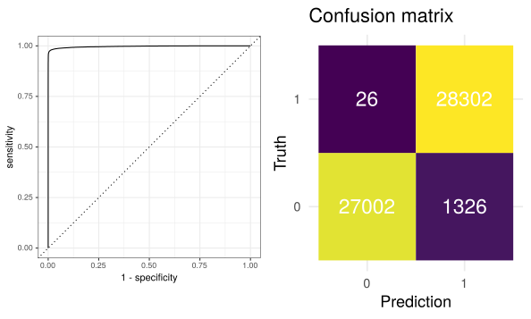

<!-- README.md is generated from README.Rmd. Please edit that file -->


# **DeepG4**: A deep learning approach to predict active G-quadruplexes

<!-- badges: start -->

[](https://codecov.io/gh/morphos30/DeepG4?branch=master)
<!-- badges: end -->

**DeepG4** is a deep learning model developed to predict the probability
of DNA sequences to form active G-Guadruplexes (found both in vitro and
in vivo). **DeepG4** is built in keras+tensorflow and is wrapped in an R
package.

## Requirements

DeepG4 was built with `Keras 2.3.1` and `tensorflow 2.1.0`, but it
should work with any version of theses libraries.

A very convenient way to install keras and tensorflow is using `R`. The
command line to install is from : <https://keras.rstudio.com/>.

``` r
install.packages("keras")
library(keras)
install_keras()
```

This will provide you with default CPU installations of Keras and
TensorFlow python packages (within a virtualenv) that can be used with
or without R.

## Installation

You can install the development version from
[GitHub](https://github.com/) with:

``` r
# install.packages("devtools")
devtools::install_github("morphos30/DeepG4")
```

## Basic usage of DeepG4

If you have a small sequence (201bp or less), you can predict the
probability that the sequence forms an active G4.

``` r
library(Biostrings)
library(DeepG4)

sequences <- system.file("extdata", "test_G4_data.fa", package = "DeepG4")
sequences <- readDNAStringSet(sequences)

predictions <- DeepG4(sequences)
head(predictions)
```

``` 
          [,1]
[1,] 0.9998598
[2,] 0.9993761
[3,] 0.9539083
[4,] 0.9974855
[5,] 0.9908580
[6,] 0.9999917
```

## Advanced usage of DeepG4

If you have a large sequence (\>201bp up to several Mbp), you can scan
the sequence and predict the positions of active G4s within the
sequence.

``` r
library(Biostrings)
library(DeepG4)
sequences <- readDNAStringSet(system.file("extdata", "promoters_seq_example.fa", package = "DeepG4"))
res <- DeepG4Scan(X = sequences,k=20,treshold=0.5)
```

DeepG4Scan function scans each input sequence with a step of `k=20` and
outputs for each input sequence the G4 positions (+/- 100bp) and the
corresponding DeepG4 probabilities (\>= treshold).

``` r
library(dplyr)
res %>% dplyr::select(-seq) %>% group_by(seqnames) %>% dplyr::slice(1:2) %>%  head
```

    # A tibble: 6 x 5
    # Groups:   seqnames [3]
      seqnames start   end width score
         <int> <int> <int> <int> <dbl>
    1        1  1241  1441   201 0.670
    2        1  1261  1461   201 0.659
    3        2  1481  1681   201 0.648
    4        2  1521  1721   201 0.517
    5        3  2161  2361   201 0.723
    6        3  2181  2381   201 0.998

## SNP effect on g-quadruplex using DeepG4

Using our model, you can predict the potential effect of a SNP on active
G4 formation :

``` r
# Function to obtain ref/alt DNA sequences from the SNP coordinates
GetSeqFromSNPs <- function(my_granges,wsize = 201){
    SNP_pos <- (wsize - 1)/2 + 1 
    ## Compute Fasta
    SNps.seq.ref <- my_granges %>% anchor_center() %>% mutate(width = wsize) %>% getSeq(BSgenome.Hsapiens.UCSC.hg19.masked,.)
    ## Replace ref by alt
    sampleMat <- matrix(FALSE,nrow = length(SNps.seq.ref),ncol = nchar(SNps.seq.ref[1]))
    sampleMat[,SNP_pos] <- TRUE
    SNps.seq.alt <- replaceLetterAt(SNps.seq.ref, sampleMat, my_granges$alt)
    return(c(SNps.seq.ref,SNps.seq.alt))
}
# Libraries
require(GenomicRanges)
require(Biostrings)
require(dplyr)
require(plyranges)
require(BSgenome.Hsapiens.UCSC.hg19.masked)
# Make a GRanges object from two known SNPs
## Genomic positions
SNPs <- GRanges(c("chr16:87350773","chr19:50093572"))
## Name and ref/alt alleles
SNPs$name <- c("rs3748393","rs7249925")
SNPs$ref <- c("C","A")
SNPs$alt <- c("A","G")

## Apply our function to get the ref/alt sequence
SNPs_seq <- SNPs %>% GetSeqFromSNPs
## And launch DeepG4 on theses sequences
DeepG4.score <- DeepG4(SNPs_seq,log_odds=T)
SNPs$DeepG4_ref <- DeepG4.score[1:length(SNPs),]
SNPs$DeepG4_alt <- DeepG4.score[(length(SNPs)+1):nrow(DeepG4.score),]
SNPs <- SNPs %>% mutate(DeltaScore = DeepG4_alt-DeepG4_ref)
SNPs %>% as_tibble()
```

    # A tibble: 2 x 11
      seqnames    start     end width strand name    ref   alt   DeepG4_ref DeepG4_alt DeltaScore
      <fct>       <int>   <int> <int> <fct>  <chr>   <chr> <chr>      <dbl>      <dbl>      <dbl>
    1 chr16    87350773  8.74e7     1 *      rs3748… C     A           1.66     -0.462      -2.12
    2 chr19    50093572  5.01e7     1 *      rs7249… A     G          -1.93      0.584       2.51

## Scan DeepG4 DNA motifs from the input sequences

Using one-hot encoding of DNA, convolution kernels (first layer of
DeepG4) can be interpreted as weighted motifs, similar to position
weight matrices (PWMs) used for DNA motifs. The function
ExtractMotifFromModel detects DeepG4 DNA motifs found in the input
sequences.

``` r
library(Biostrings)
library(DeepG4)
library(ggseqlogo)
library(cowplot)
sequences <- readDNAStringSet(system.file("extdata", "test_G4_data.fa", package = "DeepG4"))
res <- ExtractMotifFromModel(sequences)
p.pcm <- lapply(res,function(x){ggseqlogo(as.matrix(x)) + ggplot2::theme_classic(base_size=8)})
print(plot_grid(plotlist = p.pcm,ncol=4))
```


## Using DeepG4 with a new active G4 dataset

If you want to use our model architecture, but retrain with your own
dataset, you can do it by running our function `DeepG4` with `retrain =
TRUE`

``` r

library(Biostrings)
library(DeepG4)
library(rsample)

# Read positive and segative set of sequences 
sequences.pos <- readDNAStringSet(system.file("extdata", "Peaks_BG4_G4seq_HaCaT_GSE76688_hg19_201b.Fa", package = "DeepG4"))
sequences.ctrl <- readDNAStringSet(system.file("extdata", "Peaks_BG4_G4seq_HaCaT_GSE76688_hg19_201b_Ctrl_gkmSVM.Fa", package = "DeepG4"))
sequences <- c(sequences.pos,sequences.ctrl)
# Generate classes
Y <- c(rep(1,length(sequences.pos)),rep(0,length(sequences.ctrl)))
```

It’s a good idea to split your dataset in train/test to evaluate the
model performance on the testing dataset.

``` r
#  Sample dataset and get test and train dataset
smp_size <- floor(0.70 * length(sequences))
train_ind <- sample(seq_len(length(sequences)), size = smp_size)
x.train <- sequences[train_ind]
x.test <- sequences[-train_ind]
y.train <- Y[train_ind]
y.test <- Y[-train_ind]
```

Then train your model on your training dataset
:

``` r
training <- DeepG4(x.train,y.train,retrain=TRUE,retrain.path = "DeepG4_retrained.hdf5")
```

You can now take a look on the results :

``` r
library(cowplot)
p_res_train <- cowplot::plot_grid(plotlist = training[2:3])
print(p_res_train)
```



``` r
training[[4]]
```

    # A tibble: 4 x 3
      .metric     .estimator .estimate
      <chr>       <chr>          <dbl>
    1 accuracy    binary         0.978
    2 kap         binary         0.956
    3 mn_log_loss binary         9.59 
    4 roc_auc     binary         0.994

Instead of using the training dataset to evaluate the model, the best
practice is to use the test dataset :

``` r
predictions <- DeepG4(x.test,y.test,model = "DeepG4_retrained.hdf5")
p_res_test <- cowplot::plot_grid(plotlist = predictions[2:3])
print(p_res_test)
```


``` r
predictions[[4]]
```

    # A tibble: 4 x 3
      .metric     .estimator .estimate
      <chr>       <chr>          <dbl>
    1 accuracy    binary         0.890
    2 kap         binary         0.780
    3 mn_log_loss binary         8.63 
    4 roc_auc     binary         0.954
